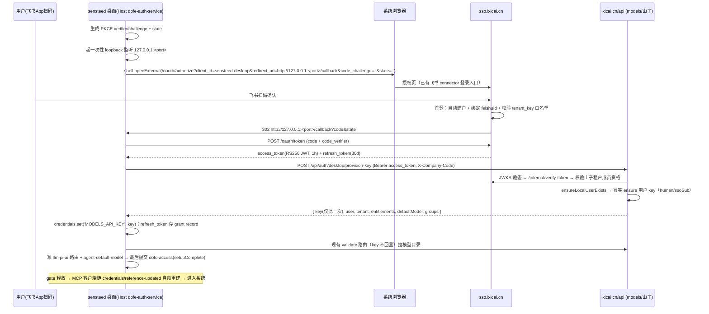

# 02 · 总体方案设计

> 面向读者：sensteed / models / sso 各仓库的实施者。目标：飞书扫码登录后自动绑定用户、自动签发用户 key、选择 MCP 与模型、进入系统；后续按飞书组织架构生成 knowledge 空间与插件权限。

## 1. 设计原则

1. **流程简单**：用户视角只有一步——"扫一次码"。其余（建户、绑定、发 key、拉目录、选模型）全部自动完成。
2. **不破坏 yootun**：所有改动以"新增分支"落地，品牌分支（`BRAND_VARIANT`）隔离两种登录形态；不 bump `DOFE_ACCESS_VALIDATION_VERSION`，yootun 已激活用户无感。
3. **身份与凭据分离**：SSO 管身份（谁在用），models 管 key 与配额（能用什么）；不给桌面端下发网关共享密钥或服务间 token。
4. **沿用已建成的链路**：key 数据面（模型/MCP/统计/配额/knowledge binding）全部继承，服务端只新增一个端点，客户端只新增一个登录模块。

## 2. 凭据模型决策：为什么保留 model_api_key

用户原始设想"MCP 依然用 model_api_key"经评估**成立**，但要改变 key 的**来源与治理方式**：

| 方案 | 结论 | 理由 |
|---|---|---|
| A. 用户手输 key（yootun 现状） | sensteed 不采用 | 用户需要先上 models Web 手动建 key，流程断裂；key 是"资产"而非"会话"，泄漏面大 |
| B. SSO JWT 直连模型/MCP | ❌ 不采用 | models 需改 guard、新增默认团队解析、修限流 keyGenerator（只读 x-api-key）、补 `GatewayUsageLog` 归因列；按 key 聚合的报表/预算/计费全部漏计（`models.dofe.ai/docs/0911` 已记录同类缺陷） |
| C. **登录时服务端幂等签发用户 key（本方案）** | ✅ 采用 | 复用 `createEmployeeKey` 的 ensure + `keyEncrypted` 回显语义（`user-api-key.service.ts:194-250`）；`@@unique([keyOwnerType, ownerExternalId])` 天然幂等；统计/配额/knowledge binding/MCP guard 零改动继承 |
| D. 中期增强：短期委托 key | ⏳ P2 可选 | `createRuntimeDelegationKey` 已支持 expiresAt/spendLimit（`user-api-key.service.ts:307-344`），未来对高风险场景可把长期用户 key 换成小时级委托 key，链路已就绪 |

**一句话**：key 还是那个 key（数据面协议不变），但从"用户的资产"变成"系统供给的凭据"——用户不接触、可吊销、可轮换、天然按人归因。

key 归属字段取值：`keyOwnerType=human`、`ownerExternalId=<ssoSub>`，租户绑定山子租户（`tenantId/ssoTeamId` 由 models 实时解析 SSO 后写入快照）。

## 3. 登录与 key 供给完整流程

### 3.1 时序



### 3.2 服务端端点契约（models 新增，本方案唯一的服务端协议新增）

`POST /api/auth/desktop/provision-key`（放在 models `apps/api/src/modules/` 下新模块，走现有 nginx `/api/` 转发，**nginx 零改动**）

- 鉴权：`Authorization: Bearer <SSO access_token>`（`SsoTokenVerifierService` JWKS 验签，现成）+ `X-Company-Code: sensteed`（品牌租户校验，平移 `dsh-plugin-desktop/src/dofe-access-route.ts` 的 `verifyDofeTenant` 逻辑：解析出的 `tenantId/tenantSlug` 必须等于品牌租户，否则 `tenant_mismatch`）。
- 逻辑：验签 → `ssoSub` → `UserSyncService.ensureLocalUserExists()` → 解析用户在山子租户的 team（`resolveSsoPairForTeam`）→ 幂等 ensure key（查 `(human, ssoSub)`，命中则 `keyEncrypted` 解密回发，未命中则创建）→ 组装响应。
- 响应体：

```jsonc
{
  "key": "sk-...",                    // 仅此一次；重复登录返回同一把（解密回显）
  "rotated": false,
  "user":   { "ssoSub": "...", "name": "...", "avatar": "..." },
  "tenant": { "tenantId": "...", "ssoTeamId": "...", "tenantSlug": "sensteed" },
  "groups": ["dept-01", "dept-02"],   // P2：来自 SSO groups claim
  "entitlements": {
    "plugins": ["knowledge", "tools-platform", "media"],  // P1 先静态配置，P2 按组织架构
    "defaultModel": "...",
    "allowedProtocols": ["chat-completions", "messages"]
  }
}
```

- 幂等与安全：同用户重复调用返回同一 key；响应带 `Cache-Control: no-store`；限流（按 IP + sub）；写入审计（登录 + 发 key 事件）。
- 可选轮换策略：`POST /api/auth/desktop/provision-key/rotate`（吊销旧 key + 签新 key），供"疑似泄漏 / 离职"场景，P1 可不做（直接在 models Web 吊销，用户下次登录 ensure 未命中自动签新 key）。

### 3.3 SSO 侧改动（配置为主，P1 零代码）

1. **注册 desktop client**（半天）：`apps/api/scripts/oauth-clients.config.ts` 新增 `sensteed-desktop`：`isConfidential=false`（public client，凭 PKCE 防截取）、`grant_types=[authorization_code, refresh_token]`、`scopes=[openid, profile, email, tenant, offline_access]`、`redirect_uris` 按 loopback 通配规则登记（治理脚本已放行 `http://127.0.0.1:*`；动态端口 + state 一次性校验）。跑 seed 脚本同步到 `OAuthClient` 表。
2. 飞书 connector 已有，无需改；P2 增加 tenant_key 白名单配置（`ConnectorConfig.config.allowTenantKeys`），拒绝非本企业飞书账号（保证"组织内部用户"）。
3. P2：access/id_token 增加 `groups` claim（飞书通讯录部门），供 knowledge `team.<groupId>` 空间与插件权限使用。

### 3.4 桌面端改动（dsh-plugin-desktop，sensteed 品牌分支）

新增三个模块 + 一处 UI 改造（均在 `dsh-plugin-desktop/`，yootun 分支不加载新模块）：

| 模块 | 职责 | 参照范式 |
|---|---|---|
| `src/dofe-auth-service.ts`（Host face service） | 登录会话状态机 `idle → pending(监听+外开浏览器) → scanned → issued → bound`；PKCE/state 生成与校验；一次性 loopback 监听器（仅绑 127.0.0.1、完成/超时(5min)/取消即关）；token 交换；调 provision 端点；静默续期（refresh → 重跑 provision） | `dofe-access-route.ts` 的 fail-closed 风格、`openmontage-window.ts` 的"外部会话交换"思路 |
| `src/dofe-auth-route.ts`（Host 私有路由） | `/api/desktop/auth/feishu/session|status|complete|cancel`，复用 `permitted()`（loopback + Origin + sec-fetch-site + JSON）栅栏；status 只回状态不回 token/key | 同上 |
| `src/client/DofeLoginSection.tsx`（Client face） | 登录 UI：二维码引导页（打开浏览器按钮 + 轮询 status）→ 成功后进入现有 `AccessForm` 的模型选择步（key 框隐藏/只读，走 useStored） | `DofeAccessSection.tsx`、`DofeOnboardingModal.tsx` |
| `src/dofe-plugins.ts` 扩展 | `DofeAccessSettings` 增加 `authMode: 'sso' | 'manual'`、`identity`（ssoSub/name/avatar，非秘密，可进 settings）；授权判定扩展为 `credentialConfigured && (authMode==='manual' || ssoBound) && setupComplete` | 现有 schema 仿写 |

关键实现约束（继承现有防线，不新造轮子）：

1. **key/token 全程不进 renderer**：loopback 回调与 token 交换都在 Host；renderer 只轮询状态；模型目录走现有 `POST /api/desktop/dofe/validate`（`useStored` 语义，key 不回显）。
2. **SSO refresh token** 存入凭据库 grant record（如 `credentialKey('dofe-auth','refresh')`，`.credentials.yaml` 0600 已有文件锁/热重载）；不用环境变量。
3. **提交顺序保持 fail-safe**：credentials.set(key) → llm-pi-ai 路由 → agent-default-model → **最后** `dofe-access.setupComplete=true`；移除时先撤授权再 unset。
4. **品牌分支**：`BRAND_VARIANT==='sensteed'` 时 onboarding 第一步为登录（manual key 降级为"高级选项"）；`yootun` 时保持现状完全不变。`DOFE_ACCESS_VALIDATION_VERSION` 不 bump。
5. **entitlements**（P1）：登录响应的 `plugins` 覆盖写入 `dofe-access.enabledPlugins`（用户仍可在设置页于允许集内微调），`dofe-managed` ROUTES 装载门照常生效；`normalizeDofePluginIds` 保留为最终防线。
6. **审计**：登录成功 / key 签发 / 权限变更写 `yootunAudit` outbox（现成 `resolveApiKey` + `credentials/reference-updated` 钩子）。

### 3.5 生命周期场景

| 场景 | 行为 |
|---|---|
| 二登（正常） | 凭据存在 + setupComplete → 无感进入；后台可用 refresh token 静默刷新身份（供 usage/身份展示） |
| key 被 Web 端吊销 | 模型调用 401 → validate 失败 → 引导重新扫码 → provision ensure 未命中自动签新 key |
| refresh token 过期（30 天未用） | 静默续期失败 → 回到登录窗（状态保留，仅重扫码） |
| 换机/重装 | 新机器扫码 → 同一 ssoSub → 幂等拿到同一把 key（或按策略轮换） |
| 员工离职 | 飞书账号停用 → SSO 登录被拒；models Web 吊销 key；P2 对账 cron 清理 knowledge 成员资格 |

## 4. 权限与统计体系

### 4.1 分层权限模型（P1 落地，P2 深化）

```
飞书组织架构（部门/角色）
   ↓ (P2: SSO 通讯录同步 → groups claim)
SSO 身份 + groups claims
   ↓ 登录时
models provision 响应 entitlements { plugins[], defaultModel, allowedProtocols }
   ↓ 写入
dofe-access.enabledPlugins → dofe-managed ROUTES 装载门（客户端执行点）
   ↓ 同一身份随 key 下行
knowledge: team.<部门ID> 空间（KnowledgeSpaceProvisioningService 自动建 + VIEWER 成员）
tools/montage/media: MCP 网关身份头（X-Dofe-Principal/Member-Id 已注入）
```

- P1：entitlements 由 models 侧静态配置（山子租户默认插件集），先跑通"服务端权威、客户端执行"。
- P2：SSO groups claim 就绪后，entitlements 按"部门 → 插件集"映射表计算；knowledge `team.<飞书部门ID>` 空间在用户首次登录时由 provisioning 服务**自动创建并授权**（已存在，含 `tenant.all` 企业空间 + `user.personal` 个人空间）。
- P2 配套：knowledge 成员对账 cron（`@dofe/sso-node` `tenants.listMembers` 重验，删除失效 `KnowledgeSpaceMember`）；群空间展示名映射（部门名）。

### 4.2 统计

- **模型/token/成本**：每用户一把 key ⇒ `GatewayUsageLog`（按 key/租户/模型/协议归因）+ `gateway_usage_daily_rollups` + `BudgetConfig`（key 级配额 + 80%/90% 告警，现成）。桌面端已有的 `/api/v1/yootun/usage`、finops 路由直接可用。
- **MCP 调用**：网关 `auth_request` 链已按 key 派生 `Principal-Id/Member-Id`；P2 OpenMontage `gateway_attribution()` 补读 `X-Dofe-Member-Id` 写入 `JobAttribution.employee_id`（字段已存在，半天）；tools 侧调用事件表 P3。
- **登录/发 key 动作**：SSO audit（`USER_LOGIN social_link/USER_REGISTER` 已有）+ models 审计 + 桌面 yootunAudit 三处齐备。

## 5. 安全要点汇总

1. PKCE S256 + state 一次性校验，public client 不落 secret；loopback 监听仅 127.0.0.1、一次性、5 分钟超时。
2. provision 端点：JWKS 验签 + 品牌租户校验（`tenant_mismatch`）+ P2 飞书 `tenant_key` 白名单（非本企业飞书拒登）+ 限流 + `no-store`。
3. key / refresh token 只进 `.credentials.yaml`（0600，跨进程文件锁）；启动环境剥离与 legacy 清理（`dofe-credential-migration.ts`）继续兜底。
4. 网关共享密钥（`MCP_GATEWAY_SHARED_SECRET`）、`INTERNAL_API_SECRET`、`OPENMONTAGE_SERVICE_TOKEN` 永不下发桌面端（现有 scrub 机制同时防客户端自报身份）。
5. 审计三处（SSO / models / 桌面 outbox）覆盖"登录、发 key、换 key、权限变更"。

## 6. 各仓库改动清单（按文件）

| 仓库 | P1 改动 | 规模 |
|---|---|---|
| sso.dofe.ai | `apps/api/scripts/oauth-clients.config.ts` 注册 `sensteed-desktop` + seed；（P2）groups claim、tenant_key 白名单 | 0.5 天 |
| models.dofe.ai | 新模块 `apps/api/src/modules/desktop-auth-api/`：provision 端点 + 契约（`packages/contracts`）+ 复用 `UserApiKeyService` ensure 语义 + 测试 | 1~2 天 |
| docker-helm.dofe.ai | 无 nginx/compose 改动；仅需 `AGENTS.md` 契约登记 + （如走 env 开关）profile env 同步 | 0.5 天 |
| dsh-desktop | `dsh-plugin-desktop`：`dofe-auth-service.ts`、`dofe-auth-route.ts`、`client/DofeLoginSection.tsx`、`dofe-plugins.ts`/`dofe-access.ts` 扩展、`index.ts` 注册、tests（仿 `dofe-access-route.spec.ts` / `client-dofe-access-gate.spec.ts`） | 3~5 天 |
| knowledge.dofe.ai | P1 零改动；（P2）对账 cron、角色映射、展示名 | P2 |
| tools.dofe.ai | P1 零改动（域级 entitlements 过渡）；（P3）身份消费 + 调用事件表 | P3 |
| OpenMontage | P1 零改动；（P2）`mcp_gateway_auth.py` 补读 Member-Id | P2 半天 |
