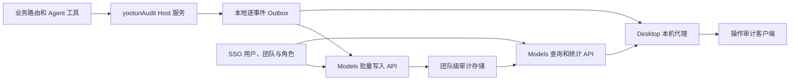

# Yootun-Agent 操作审计插件设计

状态：已实施，待用户验证

日期：2026-09-04

## 1. 决策摘要

现有“统一审批与审计”插件改造为只读的“操作审计”插件。本期不承担审批、执行编排或风险拦截，只记录已发生或已尝试的业务写操作及结果。

审计能力采用以下边界：

- `dsh-desktop` 负责采集、脱敏、本地 outbox、自动补传和本机查询代理。
- `models.dofe.ai` 负责 API Key 身份解析、集中存储、权限过滤、团队聚合和查询统计。
- `docker-helm.dofe.ai` 负责 `@dofe/dsh-yootun-audit` 客户端插件及仍由该仓库拥有的 Host 插件采集接入。
- `sso.dofe.ai` 继续作为用户、团队、团队角色和 `super_admin` 的权威来源，不承载 Yootun 业务审计正文。

各业务工作台当前已有的确认、撤销和执行机制保持不变。本次只移除中央插件自身的审批队列与批准操作，并审计既有业务流程产生的状态变化和执行结果。

本设计取代 `docs/yootun-enterprise-plugin-plan.zh.md` 中“统一审批与审计”插件的中央审批部分；该文档中的领域工作台、既有领域确认流程和其他非审批能力仍然有效，直至各自被后续设计明确取代。

## 2. 问题与证据

现有插件没有形成有价值的闭环：

1. Desktop 启用的是独立本地审批状态文件，业务插件没有向它统一入队。
2. Desktop 未向中央审批路由注入执行适配器，确认只会停留在“等待适配器”。
3. 招聘、销售和供应链分别维护自身动作队列，中央页面并不统一。
4. 原聚合 Host 在 Desktop 配置中被关闭；即使启用，也只把候选人与告警投影成内存决策，不代表真实业务动作。
5. 页面只有三个计数和空队列，无法回答“谁在何时通过什么入口，对什么对象做了什么，结果如何”。

直接用户反馈是当前页面“似乎毫无价值”。现有代码行为和真实全零界面分别提供了实现证据与产品证据。尚无 5 名以上目标用户的可用性数据，因此发布后的用户验证是交付门槛，而不是已完成结论。

## 3. 目标与非目标

### 3.1 目标

- 记录所有会改变业务状态或产生外部副作用的预装业务操作。
- 明确展示操作者、发生时间、入口、动作、业务对象、结果和追踪信息。
- 普通成员只能查看本人记录；团队 `OWNER/ADMIN` 可查看所属团队；`super_admin` 可查看任意团队。
- 审计服务失败不阻断业务，本地记录可靠保存并在恢复后补传。
- 服务端只保存脱敏结构化摘要，不保存业务正文或原始工具参数。
- 事件不可通过产品 API 修改或删除，并能抵抗重复补传和身份伪造。

### 3.2 非目标

- 不新增中央批准、拒绝、批量批准或审批策略。
- 不改变各业务工作台当前的安全确认与外部适配器执行时机。
- 不记录页面打开、刷新、搜索、筛选、分页和普通只读查询。
- 不把 SSO 身份安全日志扩展成通用业务事件库。
- 不回填或推测旧审批队列为历史审计事件。
- 不在本期提供导出、合规归档、自定义保留周期或告警规则。

## 4. 用户与核心任务

### 4.1 普通成员

目标：确认本人近期做过哪些业务处理，定位失败或尚未同步的操作。

核心任务：

1. 打开操作审计，默认查看今天的本人记录。
2. 按插件、动作、对象或结果筛选。
3. 打开事件详情，查看脱敏变化摘要与分步骤结果。

### 4.2 团队管理员

定义：当前 SSO 团队成员角色为 `OWNER` 或 `ADMIN`。

目标：核查团队成员的实际业务处理，快速定位异常结果。

额外任务：

1. 在“本人”和“团队”范围间切换。
2. 按成员筛选团队事件。
3. 查看服务账号或 Agent 代表团队执行的事件。

### 4.3 超级管理员

定义：SSO 系统角色为 `super_admin`。

目标：在任意团队范围内完成同样的只读核查。

`super_admin` 默认具备任意团队的审计查看权限，不要求先加入目标团队。进入页面仍默认显示本人范围；切换到团队范围时必须显式选择团队，避免无意加载全局数据。

## 5. 产品原则

1. 审计不是审批：界面没有确认、撤销或执行按钮。
2. 事实优先：只呈现实际发生的尝试和结果，不从候选数据推断动作。
3. 身份可信：actor 与团队均由服务端依据凭据派生，客户端不能声明。
4. 失败诚实：不可用、缓存、待同步和真实空数据具有不同状态。
5. 隐私最小化：可核查不等于保存正文，事件只包含必要结构化摘要。
6. 业务不中断：审计故障不会改变原业务操作结果。
7. 高频可扫描：列表是主工作面，详情面板承载证据和追踪信息。

## 6. 信息架构与交互

### 6.1 页面结构

主界面采用“密集列表 + 右侧详情”核查工作台：

1. 页头：标题、更新时间、同步健康状态。
2. 范围控制：成员仅显示“本人”；团队管理员显示“本人/团队”；超级管理员另有团队选择器。
3. 指标带：今日操作、成功、异常结果、待同步。
4. 筛选栏：全文检索、日期、插件、结果；团队范围增加成员筛选。
5. 事件表格：时间、操作者、操作、对象、结果。
6. 详情面板：操作信息、脱敏变更摘要、处理轨迹、事件 ID、追踪 ID、同步状态和业务对象入口。

指标不是独立分析看板，只用于帮助用户定位列表。统计口径必须与当前范围和筛选条件一致。

### 6.2 关键交互

- 点击表格行在右侧打开详情，列表滚动位置与筛选条件保持不变。
- 键盘方向键切换记录，Enter 打开，Escape 返回列表。
- 窄屏下详情替换列表，并提供明确返回按钮。
- 筛选结果为空时提供“清除筛选”；真实空状态不显示无意义操作。
- 刷新只重新查询，不重复提交已确认事件。
- 结果状态同时使用图标、文字和颜色，不只依赖颜色。
- “打开业务对象”仅导航到来源工作台，不修改审计记录。

### 6.3 界面状态

| 状态 | 行为 |
| --- | --- |
| 首次加载 | 保留固定列宽和页面高度，显示表格骨架，不先显示零值 |
| 真实空态 | 数据源健康时显示“今天还没有业务操作记录” |
| 筛选空态 | 显示当前条件无结果，并提供清除筛选 |
| 本机待同步 | 列表合并本机事件，标记待同步，显示积压数量和立即重试 |
| 服务端失败 | 保留最后可信缓存，显示缓存时间，本机新事件继续写入 outbox |
| 权限不足 | 保留本人范围，隐藏无权范围并显示稳定原因，不伪装为空数据 |
| 部分结果 | 主事件标记“部分完成”，详情逐项展示成功、失败或需登录 |

### 6.4 视觉规范

- 沿用 DSH 语义颜色、字体、间距、边框和 6px/8px 圆角，不引入独立品牌色或渐变。
- 页面是安静、紧凑的操作工具，不使用营销式大标题、装饰图形和卡片网格。
- 指标带与筛选栏使用无卡片的横向区块；详情是工作区分栏，不嵌套卡片。
- 正文字号与表格密度优先保证扫描效率；所有文字满足 WCAG AA 对比度。
- 图标使用 DSH 已导出的图标组件，陌生图标提供 Tooltip 和 `aria-label`。

## 7. 权限模型

### 7.1 服务端派生身份

Desktop 使用 credential store 中的 `MODELS_API_KEY` 调用 Models。Models 通过现有 API Key 数据平面上下文派生：

- `apiKeyId`
- `principalType`
- `principalId`
- `memberId`
- Models `tenantId`
- SSO `teamId`
- `keyOwnerType`

写入请求不得包含 `actorId`、`tenantId`、`teamId`、成员角色或超级管理员标志。出现这些字段时请求整体拒绝，不能静默忽略。

### 7.2 查询矩阵

| 身份 | 本人 | 当前团队 | 任意团队 |
| --- | --- | --- | --- |
| 普通成员 | 允许 | 拒绝 | 拒绝 |
| 团队 OWNER/ADMIN | 允许 | 允许 | 拒绝 |
| super_admin | 允许 | 允许 | 允许 |
| 团队服务账号 / Agent | 不提供交互登录视图 | 由团队管理员查看 | 由 super_admin 查看 |

团队角色和 `super_admin` 以 SSO 为权威来源。Models 可做短时权限缓存，但权限拒绝不能降级为团队数据成功。

## 8. 审计事件契约

### 8.1 客户端事件

```ts
interface YootunAuditEventInput {
  schemaVersion: 1
  clientEventId: string
  traceId: string
  occurredAt: string
  source: {
    pluginId: string
    pluginVersion: string
    surface: 'human_ui' | 'agent_tool' | 'system'
  }
  actionCode: string
  category: 'create' | 'update' | 'delete' | 'publish' | 'execute'
  target: {
    type: string
    id: string
    label?: string
  }
  outcome: 'succeeded' | 'partial' | 'failed' | 'accepted'
  changes?: Array<{
    field: string
    before?: string | number | boolean | null
    after?: string | number | boolean | null
  }>
  effects?: Array<{
    target: string
    outcome: 'succeeded' | 'failed' | 'requires_user_login' | 'accepted'
    code?: string
    remoteRef?: string
  }>
  errorCode?: string
}
```

约束：

- `clientEventId` 为 UUID，生成一次后在所有重试中保持不变。
- `actionCode` 使用稳定的点分命名，例如 `recruiter.requirement.updated`。
- `traceId` 关联一次用户意图下的发起与终态事件。
- `changes` 最多 20 项，`effects` 最多 10 项。
- 字符串字段有固定长度上限，单事件序列化后不超过 32 KiB。
- 异步任务分别记录 `accepted` 发起事件和最终事件。生产者必须为同一个终态结果复用首次生成的 `clientEventId`，由统一唯一键完成幂等；`traceId` 只用于关联，不承担去重职责。
- 只有通过身份认证且已进入业务处理器的写操作尝试才进入业务审计。跨源、认证和请求结构拒绝进入安全日志，不进入业务审计。

### 8.2 服务端事件

Models 在客户端字段之外写入：

- 服务端事件 ID 与 `receivedAt`
- Models `tenantId`、SSO `teamId`
- `apiKeyId`、`principalType`、`principalId`、`memberId`、`keyOwnerType`
- 操作者显示名快照
- `expiresAt`

服务端唯一约束为 `(tenantId, clientEventId)`。事件表按团队与时间、成员与时间、动作与时间、结果与时间建立索引。

产品 API 不提供更新和删除。保留期清理是服务端系统操作，不对客户端开放。

### 8.3 隐私边界

允许保存：

- 稳定对象 ID、脱敏显示名、状态枚举、数量、渠道名、稳定错误码、远端引用 ID。
- 白名单字段的前后状态，例如 `draft -> active`。

禁止保存：

- `MODELS_API_KEY`、内部服务密钥、Cookie、Token 和授权头。
- 消息正文、文章正文、简历内容、联系方式、身份证件和受保护招聘属性。
- 用户提示词、模型回复、原始工具参数、原始 MCP 响应和堆栈。
- 完整文件内容和本机绝对路径。

每个动作代码必须配套专用脱敏投影器。禁止以通用 `metadata: Record<string, unknown>` 直接透传业务对象。

## 9. 系统架构



### 9.1 Desktop Host 服务

`dsh-plugin-desktop` 提供 Cordis 服务 `yootunAudit`：

```ts
interface YootunAuditService {
  record(event: YootunAuditEventInput): Promise<void>
  retrySync(): Promise<AuditSyncSnapshot>
  snapshot(query: AuditQuery): Promise<AuditWorkspaceSnapshot>
}
```

`record()` 先将单个事件原子写入本地 pending 目录，再触发后台同步。写入和同步错误均不会改变原业务响应，但必须进入稳定 Host 日志和 UI 健康状态。

业务插件显式调用该服务，不全局包装 `ctx.tools.execute`。显式采集才能区分读写语义并产生脱敏业务摘要。

### 9.2 本地 outbox

路径：

```text
<dsh-home>/storages/yootun-audit/
  pending/<clientEventId>.json
  quarantine/<clientEventId>.json
  cache.json
  sync-state.json
```

- 每条事件独立原子写入，目录权限 `0700`，文件权限 `0600`。
- 拒绝符号链接、超限文件和非法事件结构。
- 成功同步后删除对应 pending 文件；最后可信服务端列表保存在 `cache.json`。
- 损坏事件移入 quarantine，不删除；UI 显示需要关注的本地记录数量。
- 新事件、应用启动、网络恢复和用户手动重试都会触发同步。
- 每批最多 50 条，指数退避从 2 秒增长到 5 分钟并带抖动。
- 已同步缓存保留 30 天；未同步与隔离事件不按时间自动删除。

### 9.3 集中存储

Models 新增独立 `YootunAuditEvent` 数据模型，不复用 SSO `AuditLogAction` 封闭枚举。服务端事件默认保留 365 天，按 `expiresAt` 执行后台清理。

## 10. API 设计

### 10.1 Models API

```text
POST /api/v1/yootun/audit-events/batch
GET  /api/v1/yootun/audit-events
GET  /api/v1/yootun/audit-events/summary
GET  /api/v1/yootun/audit-events/scopes
GET  /api/v1/yootun/audit-events/teams
```

写入：

- 使用 Models API Key Bearer 认证。
- 一批最多 50 条，总请求体不超过 512 KiB。
- 服务端验证完整批次；任一事件结构非法时整批返回 400，不产生部分写入。
- 重复事件返回原服务端 ID，不重复插入。
- 返回逐事件的 `clientEventId`、服务端 ID 和接收时间。

查询：

- 使用游标分页，默认 50 条，最大 100 条。
- 支持 `scope=self|team`、时间范围、插件、动作、成员、对象、结果和搜索词。
- 普通成员的 `scope=team` 返回 403。
- 团队管理员只能查询 API Key 所属 SSO 团队。
- `super_admin` 可带目标 SSO team ID；省略目标时不返回全局事件。
- `scopes` 返回当前账号可用范围、当前团队和 `isSuperAdmin`，不枚举全部团队。
- `teams` 仅供 `super_admin` 使用，按名称或 ID 搜索并使用游标分页；普通账号调用返回 403。超级管理员必须从该结果中显式选择一个团队后才能发起团队查询。

### 10.2 Desktop 本机 API

```text
GET  /api/desktop/yootun/audit
POST /api/desktop/yootun/audit  { "action": "retry_sync" }
```

本机 API 延续 loopback、Host、Origin、`Sec-Fetch-Site`、JSON Content-Type 和无重定向约束。Renderer 不读取凭据，也不直连 Models。

GET 响应包含服务端事件、本机 pending 事件、同步健康、数据新鲜度、权限范围和指标。合并时按 `clientEventId` 去重。

## 11. 首期动作目录

| 插件 | 记录动作 | 明确不记录 |
| --- | --- | --- |
| 招聘 | 岗位新增/更新、候选分析保存、BOSS 同步结果、知识发布、既有动作确认/撤销/执行结果 | 列表读取、同步预览、打开登录页 |
| 销售 | 线索保存、跟进动作创建、确认/撤销/执行结果 | 意图查询、列表读取 |
| 供应链 | 风险保存、复核动作创建、确认/撤销/执行结果 | 风险列表读取 |
| GEO 内容 | 审核结果、渠道选择变化、发布请求、各渠道结果 | 列表刷新、打开平台登录页 |
| 企业知识 | remember、confirm memory、forget、文件导入 | search、recall、graph |
| 线索发现 | 持久化发现任务发起与结果 | 翻页、已存候选读取 |
| 改装案例 | 主动刷新公开来源及结果 | 数据库列表和搜索 |
| 小红书仿写 | 任务创建、首次观察到的最终结果 | 状态轮询、结果重复读取 |
| 媒体上传 | 上传完成或失败 | 授权探测、元数据读取 |
| 总览、FinOps、日报 | 本期无采集动作 | 全部只读操作 |

新增写操作必须在同一变更中登记动作代码、脱敏投影器、成功测试和失败测试。动作目录门禁扫描所有预装业务插件，未登记的写操作使检查失败。

## 12. 错误处理与一致性

- 业务成功、审计本地写入失败：业务仍成功；Host 记录稳定错误，UI 健康状态显示本地审计异常。
- 业务失败：只要请求通过认证与业务结构校验并进入写处理器，就记录 `failed` 与稳定错误码。
- Models 401/403：停止自动重试认证错误，UI 指引恢复凭据或权限；pending 事件保留。
- Models 429/5xx/网络错误：指数退避重试，不清除 pending。
- 批次含非法本地事件：逐条重新验证，将非法事件移入 quarantine，其余事件继续下一批。
- 查询失败：展示最后可信缓存及缓存时间，不把失败变成零值。
- 客户端时钟偏差：同时展示 `occurredAt` 和服务端 `receivedAt`；未来偏差超过 5 分钟时服务端附加时钟偏差标记，不改写原发生时间。
- 多渠道部分成功：主事件为 `partial`，分步骤结果保存在受限 `effects`。

## 13. 迁移与发布

### 13.1 命名迁移

- npm 包：`@dofe/dsh-yootun-approvals` 改为 `@dofe/dsh-yootun-audit`。
- Desktop 路由：`/api/desktop/yootun/approvals` 改为 `/api/desktop/yootun/audit`。
- 本地目录：`yootun-approvals` 改为 `yootun-audit`。
- UI：侧栏“统一审批”改为“操作审计”。

旧审批状态文件不导入、不主动删除。旧路由在新客户端发布后移除，不提供带有误导语义的兼容响应。

### 13.2 发布顺序

1. `models.dofe.ai` 发布审计表、身份授权、批量写入、查询、统计和保留任务。
2. `dsh-desktop` 发布 `yootunAudit` 服务、outbox、查询代理和 Desktop-owned 采集点。
3. `docker-helm.dofe.ai` 发布更名后的客户端包和该仓库 Host 插件采集点。
4. `dsh-desktop` 更新 file 依赖、bundle patch、包闭包和发布测试。
5. 所有端到端门禁通过后移除旧审批 Host 与客户端资产。

各仓库使用小型中文 Conventional Commits，并分别推送到 `origin`。不直接修改 CI checkout；部署只能消费已推送提交。

### 13.3 回滚

回滚只隐藏新入口并停止同步，不删除 Models 事件、本地 pending 或 quarantine。恢复版本后继续补传。业务工作台不依赖审计服务，因此回滚不影响业务操作。

## 14. 测试与验收

### 14.1 Models

- 客户端提交身份字段时整批拒绝。
- 普通成员不能读取其他成员或团队记录。
- 团队管理员只能读取所属团队。
- `super_admin` 可读取显式选择的任意团队，不能无条件拉取全局数据。
- 重复补传只产生一条记录并返回相同服务端 ID。
- 游标分页、组合筛选、统计口径和 365 天清理正确。
- 10 万条团队记录下常用筛选查询 P95 小于 1 秒。

### 14.2 Desktop Host

- 并发写入不丢事件，重启后 pending 可恢复。
- 429、5xx、断网和认证失败遵循规定重试策略。
- 损坏事件进入 quarantine，不拖垮健康批次。
- 服务端记录与本地 pending 合并后无重复。
- 审计错误不改变业务路由响应。
- 所有动作投影均通过禁止字段扫描。

### 14.3 业务插件

- 动作目录覆盖率 100%。
- 每个写操作至少覆盖成功和失败事件。
- UI 与 Agent 工具两种入口正确标记 `surface`。
- 只读操作不会产生审计事件。
- 异步任务最终结果只记录一次。

### 14.4 客户端

- 覆盖加载、真实空态、筛选空态、离线、缓存降级、权限不足、部分结果和分页失败。
- 表格与详情支持键盘操作和正确焦点恢复。
- 在 320、768、1024 和 1440 像素宽度验证无重叠、溢出和布局跳动。
- 通过 WCAG AA 对比度与自动化可访问性检查。
- Playwright 截图覆盖普通成员、团队管理员和超级管理员视图。

### 14.5 端到端场景

使用两个普通成员、一个团队管理员和一个超级管理员验证：

1. UI 写操作产生本人事件。
2. Agent 工具写操作正确标注来源。
3. 断网操作在恢复后补传。
4. 团队管理员看到本团队两个成员，但看不到其他团队。
5. 超级管理员选择目标团队后看到对应事件。
6. 重复上传不产生重复行。
7. 事件详情不包含禁止字段。

## 15. 成功标准与用户验证

- 动作目录覆盖率：100%。
- 重复事件率：0。
- 跨用户或跨团队越权读取：0。
- 在线事件 95% 在 30 秒内可查询。
- 网络恢复后 95% pending 在 60 秒内完成补传。
- 核心任务完成率高于 85%，目标 SUS 高于 80。

发布后邀请 5 名目标用户完成三项任务：查找本人最近一次写操作、定位一条失败事件、以管理员身份核查指定成员操作。记录任务完成率、用时、错误数和 SUS。任何导致错误归因、无法识别缓存数据或越权暴露的发现均为阻断级问题。

## 16. 实施完成定义

完成必须同时满足：

1. Models、Desktop、客户端插件和所有首期采集点均已实现并分别通过仓库门禁。
2. 三种身份的权限和端到端场景通过自动化验证。
3. 旧中央审批入口、路由、依赖和误导文案已移除。
4. 各业务工作台既有安全确认机制未发生行为回归。
5. 所有提交使用中文 Conventional Commits 并推送至各自 `origin`。
6. 实机界面通过桌面和窄屏视觉检查，且无控制台错误。

## 17. 实施与自动化验收记录

2026-09-05 已完成 Models、Desktop 和 Docker 三个仓库的实现与发布分支推送。中央审批客户端、Desktop Host 路由和预装依赖已删除，领域工作台既有确认流程保持不变；操作审计采用只读工作台、服务端授权查询和 Desktop 可靠补传。

已执行并通过：

- Models 全量质量门禁；
- Desktop 审计契约、存储、补传、路由及四个本机采集器测试；
- Docker 审计工作台及知识、发现、公开源刷新、小红书仿写、媒体上传采集器测试；
- `corepack pnpm --filter dsh-plugin-desktop exec vitest run tests/package.spec.ts tests/plugin.spec.ts tests/yootun-audit-integration.spec.ts`；
- `corepack pnpm --filter dsh-plugin-desktop run test:audit-ui`。

实施后独立审查进一步完成以下加固：权限缓存不再覆盖缺失凭据、401 或 403，pending 事件按 API Key 指纹隔离并将身份不匹配事件移入 quarantine；Models 使用独立动作投影白名单重新校验分类、目标类型和变更字段；补传批次限制在 512 KiB 内，并隔离永久拒绝事件；本地 pending 与首屏查询合并展示；指标统一为今日、成功、异常和待同步；失败的业务写入尝试同样产生脱敏审计；终态执行重放不会重复记录；异步工具的信封级失败与小红书完成版本数按真实结果归类。

2026-09-05 本轮新鲜验证结果：

- `corepack pnpm quality:gate`（Models）退出码 0；
- `corepack pnpm check`（Desktop）退出码 0，136 个测试文件通过，1236 条测试通过、4 条预期跳过；
- 五个 Docker 采集插件分别执行 `npm run check`，知识 14 条、线索 7 条、改装 7 条、小红书 21 条、媒体上传 63 条测试全部通过；
- 跨仓集成门禁实际执行 8 条打包采集器审计行为测试，覆盖成功与失败归类、只读排除、终态去重及敏感正文隔离；
- 四个 Desktop 业务路由的失败写入审计回归与审计服务测试共 78 条通过，包级 TypeScript 检查通过。

浏览器验收使用隔离 Playwright 会话加载实际 `dsh-yootun-audit/src/client.js`，以受控同源响应覆盖加载、真实空态、筛选空态、在线表格与详情、离线缓存、待同步重试、普通成员、团队管理员和超级管理员显式选团队。320、768、1024、1440 像素视口均通过页面溢出、剩余高度、可访问名称、对话框语义、代表性 WCAG AA 对比度、键盘详情/关闭/焦点恢复、控制台和请求路径断言；14 次业务请求只访问 `/api/desktop/yootun/audit`。

截图证据位于 `docs/superpowers/evidence/2026-09-05-yootun-audit/`：

- `320-member-list.png`、`320-event-detail.png`；
- `768-offline-cache.png`；
- `1024-pending-sync.png`、`1024-empty.png`、`1024-filtered-empty.png`、`1024-loading.png`；
- `1440-superadmin-detail.png`。

尚未完成的发布后验证包括：使用获批非生产环境进行 10 万行查询 P95、真实断网重启补传，以及 5 名目标用户的任务完成率和 SUS。完成这些项目之前，状态保持“已实施，待用户验证”，不得标记为“已验证”。

### 17.1 发布与部署验证边界

本轮发布前后补充验证如下：Models 的 `benchmark:yootun-audit` 入口已兼容 TypeScript 6 的命令行解析，并通过 10 条参数与安全边界测试；Models `quality:gate` 与 API 类型检查均通过。公网 Models 健康检查返回 HTTP 200，未携带 API Key 访问审计查询返回 HTTP 401，说明服务可达且鉴权边界生效。

Desktop 已触发 `dev` 分支 GitHub CI，执行完整检查及 Windows/macOS 打包流程。该 CI 只能证明提交可构建、可测试和可产出安装包，不等同于生产部署。Docker Compose 配置检查通过，但当前环境无法访问 Jenkins `172.30.30.11:18080`，因此本轮没有直接触发生产 Jenkins 发布，也没有宣称生产已部署。

10 万行基准仍必须在获批的非生产数据库上运行；脚本会拒绝生产数据库主机，当前本机没有可用数据库，所以不能用本地失败连接替代真实性能结论。部署完成后应按 Docker 仓库发布说明重新执行健康、鉴权、基准和断网重启补传 smoke。
